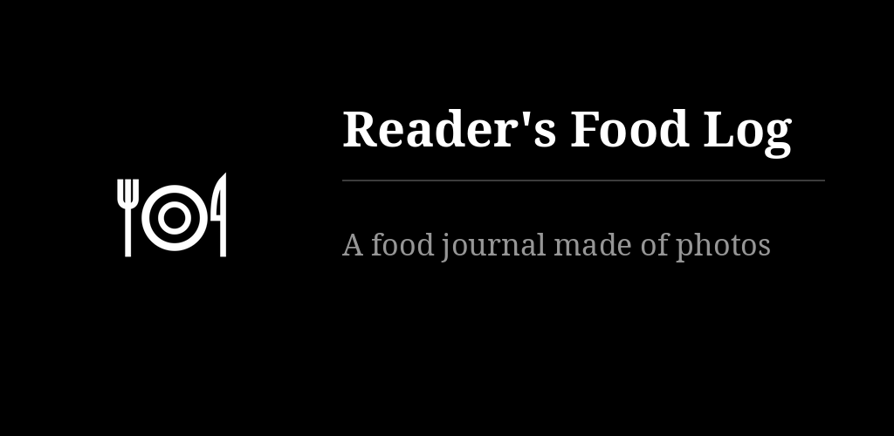

# Reader's Food Log

One touch photographs what you are about to eat; the app labels it breakfast, lunch, dinner
or snack and files it by day. No calories, no database, no typing. Activity in one tap,
weight once a day with its curve. No network permission; the journal exports as a zip.

## Key points

- Taking a photo: one touch on the widget, one touch anywhere on the viewfinder (or a volume
  key), and the screen closes by itself.
- Ways in: a 1×1 camera widget, a 4×1 widget (today's count, pencil, camera), a quick-settings
  tile that works over the lock screen, launcher shortcuts, and the food log tile of
  [Reader's Launcher](https://github.com/funkypitt/readers-launcher), a shortcut to the viewfinder.
- Home is one folder per day; open a day for its photos in the order of the clock. Touch a
  photo to change its label, share it or delete it.
- Physical activity in one tap: strength training, intense activity, endurance, or a free line.
- Weight, once a day: one tap opens the number pad; a curve shows 30 days, 90 days, a year or
  everything. Stored in kilograms, shown in kg or lb.
- Local only: camera permission, no network permission, no account, Android backup off.
- Export the journal as one zip and import it on another phone; importing merges and replaces nothing.
- Black and white, text only, six languages (en, fr, de, es, pt, ru).

More detail: [docs/NOTES.md](docs/NOTES.md).

## Install

Signed APK in the [releases](https://github.com/funkypitt/readers-foodlog/releases/latest), or add the
F-Droid repository `https://funkypitt.github.io/fdroid-repo/repo`.

## Build

    export JAVA_HOME=/path/to/jdk-21
    ./gradlew assembleDebug

Strings for the six languages are generated from the table in `tools/strings.py`.

MIT licence.
